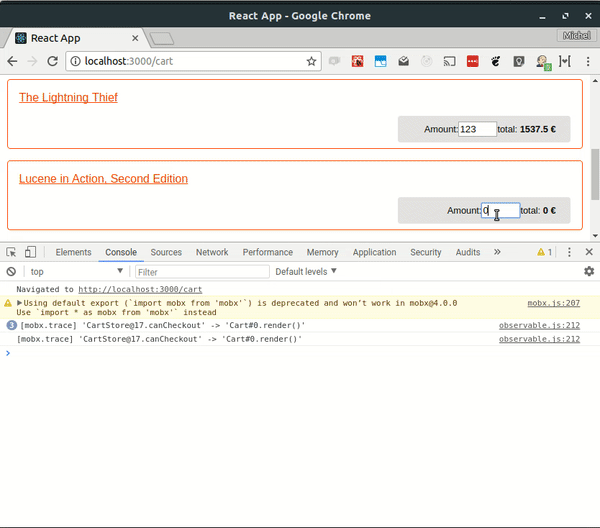

<script async type="text/javascript" src="//cdn.carbonads.com/carbon.js?serve=CEBD4KQ7&placement=mobxjsorg" id="_carbonads_js"></script>

# Debugging MobX [🚀]

# Using `trace` for debugging

Trace is a small utility that helps to find out why your computed values, reactions or components are re-evaluating.

It can be used by simply importing `import { trace } from "mobx"`, and then put it inside a reaction or computed value.
It will print why it is re-evaluating the current derivation.

Optionally it is possible to automatically enter the debugger by passing `true` as last argument.
This way the exact mutation that causes the reaction to re-run is still in stack, usually ~8 stack frames up. See the image below.

In debugger mode, the debug information will also reveal the full derivation tree that is affecting the current computation / reaction.




## Live examples

[Simple CodeSandbox `trace` example](https://codesandbox.io/s/trace-dnhbz?file=/src/index.js:309-338)

Here's a deployed example for exploring the stack: https://csb-nr58ylyn4m-hontnuliaa.now.sh/
Be sure to play with chrome debugger's blackbox feature!

## Usage examples

There are different ways of calling `trace()`, some examples:

```javascript
import { observer } from "mobx-react"
import { trace } from "mobx"

const MyComponent = observer(() => {
    trace(true) // enter the debugger whenever an observable value causes this component to re-run
    return <div>{this.props.user.name}</name>
})
```

Enable trace by using the `reaction` argument of an reaction / autorun:

```javascript
mobx.autorun("logger", reaction => {
    reaction.trace()
    console.log(user.fullname)
})
```

Pass in the property name of a computed property:

```javascript
trace(user, "fullname")
```

# Introspection APIs

The following APIs might come in handy if you want to inspect the internal state of MobX while debugging, or want to build cool tools on top of MobX.
Also relevant are [`toJS`](tojson.md) and the various [`isObservable*` APIs](api.md#isobservable).

### `getDebugName`

Usage:

-   `getDebugName(thing, property?)`

Returns a (generated) friendly debug name of an observable object, property, reaction etc. Used by for example the [MobX developer tools](https://github.com/mobxjs/mobx-devtools).

### `getDependencyTree`

Usage:

-   `getDependencyTree(thing, property?)`.

Returns a tree structure with all observables the given reaction / computation currently depends upon.

### `getObserverTree`

Usage:

-   `getObserverTree(thing, property?)`.

Returns a tree structure with all reactions / computations that are observing the given observable.

### `getAtom`

[🚀] Usage:

-   `getAtom(thing, property?)`.

Returns the backing _Atom_ of a given observable object, property, reaction etc.

# Spy [🚀]

Usage:

-   `spy(listener)`

Registers a global spy listener that listens to all events that happen in MobX.
It is similar to attaching an `observe` listener to _all_ observables at once, but also notifies about running (trans/re)actions and computations.
Used for example by the [MobX developer tools](../react/react-integration/md#mobxdevtools).

Example usage of spying all actions:

```javascript
spy(event => {
    if (event.type === "action") {
        console.log(`${event.name} with args: ${event.arguments}`)
    }
})
```

Spy listeners always receive one object, which usually has at least a `type` field. The following events are emitted by default by spy.

| type                            | observableKind | other fields                                          | nested |
| ------------------------------- | -------------- | ----------------------------------------------------- | ------ |
| action                          |                | name, object (scope), arguments[]                     | yes    |
| scheduled-reaction              |                | name                                                  | no     |
| reaction                        |                | name                                                  | yes    |
| error                           |                | name, message, error                                  | no     |
| add,update,remove,delete,splice | \*             | see [observe](observe.md)                             | yes    |
| report-end                      |                | spyReportEnd=true, time? (total execution time in ms) | no     |

The `report-end` events are part of an earlier fired event that had `spyReportStart: true`.
This event indicates the end of an event and this way groups of events with sub-events are created.
This event might report the total execution time as well.

The spy events for observable values are identical to the events passed to `observe`. See [intercept & observe](observe.md#event-overview) for an extensive overview.

In production builds, the `spy` API is a no-op as it will be minimized away.
