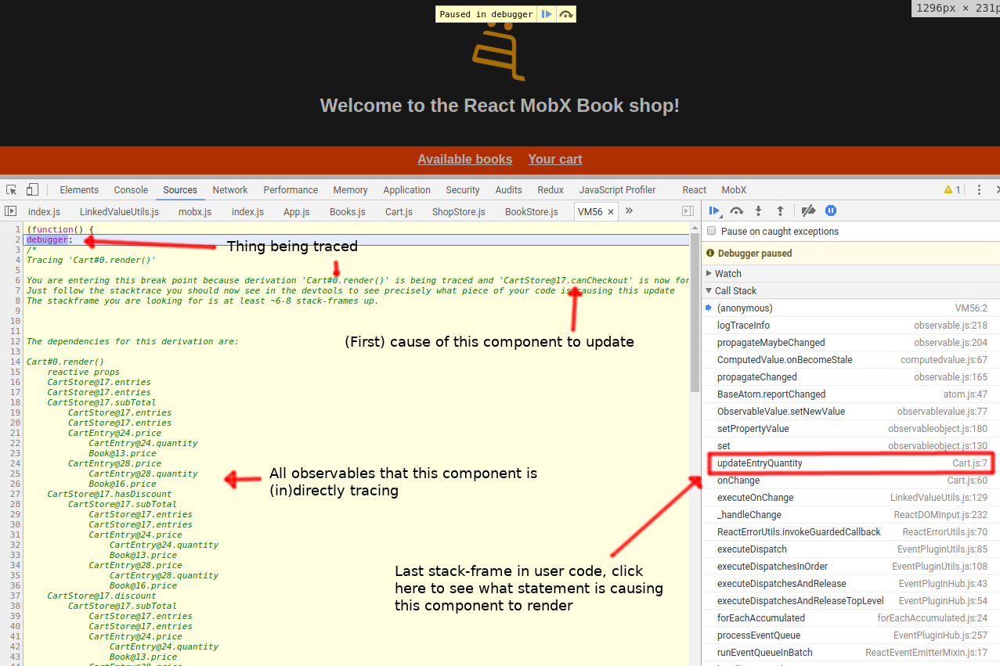

<script async type="text/javascript" src="//cdn.carbonads.com/carbon.js?serve=CEBD4KQ7&placement=mobxjsorg" id="_carbonads_js"></script>

# Using `trace` for debugging

Trace is a small utility that helps to find out why your computed values, reactions or components are re-evaluating.

It can be used by simply importing `import { trace } from "mobx"`, and then put it inside a reaction or computed value.
It will print why it is re-evaluating the current derivation.

Optionally it is possible to automatically enter the debugger by passing `true` as last argument.
This way the exact mutation that causes the reaction to re-run is still in stack, usually ~8 stack frames up. See the image below.

In debugger mode, the debug information will also reveal the full derivation tree that is affecting the current computation / reaction.




## Live examples

[Simple CodeSandbox `trace` example](https://codesandbox.io/s/trace-dnhbz?file=/src/index.js:309-338)

Here's a deployed example for exploring the stack: https://csb-nr58ylyn4m-hontnuliaa.now.sh/
Be sure to play with chrome debugger's blackbox feature!

## Usage examples

There are different ways of calling `trace()`, some examples:

```javascript
import { observer } from "mobx-react"
import { trace } from "mobx"

const MyComponent = observer(() => {
    trace(true) // enter the debugger whenever an observable value causes this component to re-run
    return <div>{this.props.user.name}</name>
})
```

Enable trace by using the `reaction` argument of an reaction / autorun:

```javascript
mobx.autorun("logger", reaction => {
    reaction.trace()
    console.log(user.fullname)
})
```

Pass in the property name of a computed property:

```javascript
trace(user, "fullname")
```
